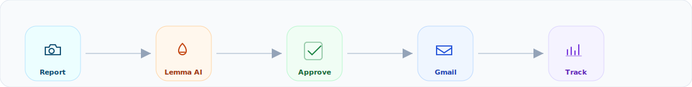
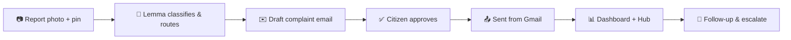
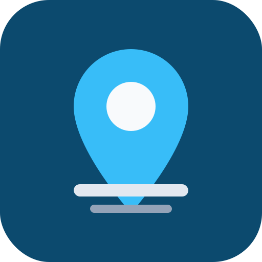

<p align="center">
  
</p>

<p align="center">
  <a href="https://gappy.ai"></a>
  <a href="https://lemma.work"></a>
  <a href="https://urbis-lemma.vercel.app"></a>
  
  
</p>

<p align="center">
  <strong>See a civic problem. Route it to the right authority. Send it from your own Gmail.</strong>
</p>

<p align="center">
  <a href="https://urbis-lemma.vercel.app"><b>Launch app</b></a> ·
  <a href="https://urbis-ce0h.onrender.com/api/health/live">API status</a> ·
  <a href="./docs/ARCHITECTURE.md">Architecture</a> ·
  <a href="./docs/API.md">API</a> ·
  <a href="./docs/DEPLOY.md">Deploy</a>
</p>

---

## Overview

**Urbis** helps citizens report potholes, garbage, broken streetlights, and other civic issues in under a minute. The app uses the **Lemma SDK** to classify the problem, find the right municipal contact, and draft a formal complaint — but **nothing is emailed until the citizen reviews and approves it**.

<p align="center">
  
</p>

| | |
|:--|:--|
| **Problem** | Citizens do not know which department to contact, and formal complaints are too much friction. |
| **Solution** | Photo + map pin → Lemma routes & drafts → human approval → Gmail send → dashboard tracking. |
| **Principle** | Human-in-the-loop by design. Your email, your approval, your audit trail. |

---

## Live demo

| Resource | Link |
|----------|------|
| Web app | [urbis-lemma.vercel.app](https://urbis-lemma.vercel.app) |
| REST API | [urbis-ce0h.onrender.com](https://urbis-ce0h.onrender.com) |
| Health | [/api/health/live](https://urbis-ce0h.onrender.com/api/health/live) |
| Lemma status | [/api/health/lemma](https://urbis-ce0h.onrender.com/api/health/lemma) |

> Sign in with Google → report an issue → approve the draft → track it on your dashboard.

---

## Table of contents

<details open>
<summary><b>Navigate</b></summary>

- [Key features](#key-features)
- [How it works](#how-it-works)
- [Lemma integration](#lemma-integration)
- [Architecture](#architecture)
- [Tech stack](#tech-stack)
- [Quick start](#quick-start)
- [Configuration](#configuration)
- [Testing & deployment](#testing--deployment)
- [Project layout](#project-layout)
- [Demo script](#demo-script-judges)
- [Documentation](#documentation)

</details>

---

## Key features

<table>
<tr>
<td width="50%" valign="top">

### For citizens
- Photo + map reporting with geolocation
- AI issue classification (Lemma + keywords)
- Edit To, subject, and body before send
- Complaints sent from **your Gmail**
- Dashboard with status filters & timeline
- Follow-up photos & resolution checks

</td>
<td width="50%" valign="top">

### For municipalities & community
- Structured, location-tagged complaints
- Routing to verified `.gov.in` contacts
- Community Hub with public reports & upvotes
- Duplicate detection near existing reports
- Auto-escalation for stale cases
- Full audit: `processing_path` + `lemma_invocations`

</td>
</tr>
</table>

---

## How it works



| Step | Screen | What happens |
|:----:|--------|--------------|
| 1 | `/` | Welcome page → Google sign-in |
| 2 | `/new` | Upload photo, pin location, describe issue |
| 3 | API | Geocode → Lemma pod → draft email to authority |
| 4 | `/approvals/:id` | Review recipient, subject, body → approve |
| 5 | Gmail | Complaint delivered from citizen account |
| 6 | `/dashboard` | Track status, upload follow-up photos |
| 7 | `/hub` | Browse community reports, upvote urgent issues |

---

## Lemma integration

Urbis is built on the **[Lemma SDK](https://github.com/lemma-work/lemma-platform)**. When the `civic-lens` pod is reachable, **Lemma runs first** on every report. Local verified contacts are fallback only.

**Pod location:** `pod/civic-lens/`

| Resource type | Names |
|---------------|-------|
| Agents | `issue-classifier` · `complaint-drafter` · `resolution-checker` |
| Functions | `create_petition` · `send_complaint_email` · `escalate_petition` · `update_resolution_status` |
| Workflows | `petition-pipeline` · `escalation-pipeline` |
| Tables | `petitions` · `departments` · `activity_log` |
| Schedule | `daily-resolution-check` |

| User action | Lemma path |
|-------------|------------|
| Submit report | `petition-pipeline` → `issue-classifier` → `complaint-drafter` |
| Approve & send | `send_complaint_email` + Gmail |
| Upload follow-up | `resolution-checker` → `update_resolution_status` |
| Stale complaint | `escalation-pipeline` → `escalate_petition` |

---

## Architecture

<p align="center">
  
</p>

<p align="center">
  
</p>

<p align="center">
  <sub>React · FastAPI · MongoDB · Lemma · Gmail · Cloudinary · Nominatim</sub>
</p>

Deep dive → **[docs/ARCHITECTURE.md](./docs/ARCHITECTURE.md)**

---

## Tech stack

| Layer | Technology |
|-------|------------|
| Frontend | React 18 · Vite · Tailwind CSS |
| Backend | FastAPI · Motor (async MongoDB) |
| Database | MongoDB Atlas |
| AI | Lemma SDK (`civic-lens` pod) |
| Auth | Google OAuth + session cookies |
| Email | Gmail API · Brevo SMTP fallback |
| Media | Cloudinary |
| Hosting | Vercel (app) · Render (API) |

---

## Quick start

**Prerequisites:** Python 3.11+ · Node 18+ · MongoDB (local or Docker)

```bash
git clone https://github.com/Girisankarsm/Urbis.git
cd Urbis
./scripts/setup.sh
./scripts/run-local.sh
```

| Service | Local URL |
|---------|-----------|
| App | http://localhost:5173 |
| API | http://localhost:8000/api/health |
| Lemma | http://localhost:8000/api/health/lemma |

<details>
<summary><b>Lemma pod setup (required for full demo)</b></summary>

```bash
cd backend && .venv/bin/lemma auth login
cd .. && ./scripts/sync-lemma-env.sh
# Set LEMMA_POD_ID + LEMMA_ORG_ID from lemma.work dashboard
./scripts/restart-api.sh
```

Confirm `/api/health/lemma` returns `"live": true`.

</details>

<details>
<summary><b>Run without Docker</b></summary>

```bash
# Terminal 1
cd backend && MONGODB_URL=mongodb://localhost:27017 \
  .venv/bin/uvicorn app.main:app --reload --port 8000

# Terminal 2
cd frontend && npm run dev
```

</details>

---

## Configuration

Copy `.env.example` → `.env` for local development.

| Variable | Purpose |
|----------|---------|
| `MONGODB_URL` | MongoDB connection string |
| `LEMMA_REFRESH_TOKEN` · `LEMMA_POD_ID` · `LEMMA_ORG_ID` | Lemma civic-lens pod |
| `GOOGLE_CLIENT_ID` · `GOOGLE_CLIENT_SECRET` | Sign-in + Gmail send |
| `CLOUDINARY_*` | Image hosting (required in production) |
| `SMTP_*` | Email fallback when Gmail unavailable |
| `DEMO_EMAIL_REDIRECT` | Set `false` to email real authorities |

Templates: `.env.example` · `.env.production.example`

---

## Testing & deployment

```bash
./scripts/test.sh                 # backend + frontend
cd backend && pytest -q           # API tests
cd frontend && npm test           # client tests
./scripts/check-deploy-ready.sh   # production pre-flight
```

| Environment | Platform |
|-------------|----------|
| API | [Render](https://render.com) — `render.yaml` |
| Frontend | [Vercel](https://vercel.com) — proxies `/api` to Render |
| Database | MongoDB Atlas |
| Lemma | [lemma.work](https://lemma.work) |

Full guide → **[docs/DEPLOY.md](./docs/DEPLOY.md)**

---

## Project layout

```
Urbis/
├── backend/              # FastAPI API, services, tests
├── frontend/             # React + Vite SPA
├── pod/civic-lens/       # Lemma agents, workflows, functions
├── docs/                 # Architecture, API, deploy, images
├── scripts/              # setup, run-local, lemma sync, deploy checks
├── docker-compose.yml
├── render.yaml
└── .env.example
```

---

## Demo script (judges)

**~90 seconds**

1. Open [urbis-lemma.vercel.app](https://urbis-lemma.vercel.app) → sign in with Google
2. Verify [Lemma health](https://urbis-ce0h.onrender.com/api/health/lemma) → `live: true`
3. **Report** a civic issue (photo + pin in Chennai or Bengaluru)
4. **Dashboard** → open draft → **Review & Approve**
5. **Send** from Gmail → timeline shows `Sent`
6. **Hub** → upvote the public report
7. Show `processing_path: lemma` on the petition record

---

## Documentation

| Document | Contents |
|----------|----------|
| [docs/ARCHITECTURE.md](./docs/ARCHITECTURE.md) | System design & pipelines |
| [docs/API.md](./docs/API.md) | REST API reference |
| [docs/DEPLOY.md](./docs/DEPLOY.md) | Production hosting |
| [pod/civic-lens/README.md](./pod/civic-lens/README.md) | Lemma pod resources |

---

<p align="center">
  
</p>

<p align="center">
  <sub>MIT License · Built for the <a href="https://gappy.ai">Gappy AI Hackathon</a></sub><br />
  <sub><a href="https://github.com/Girisankarsm/Urbis">github.com/Girisankarsm/Urbis</a></sub>
</p>
