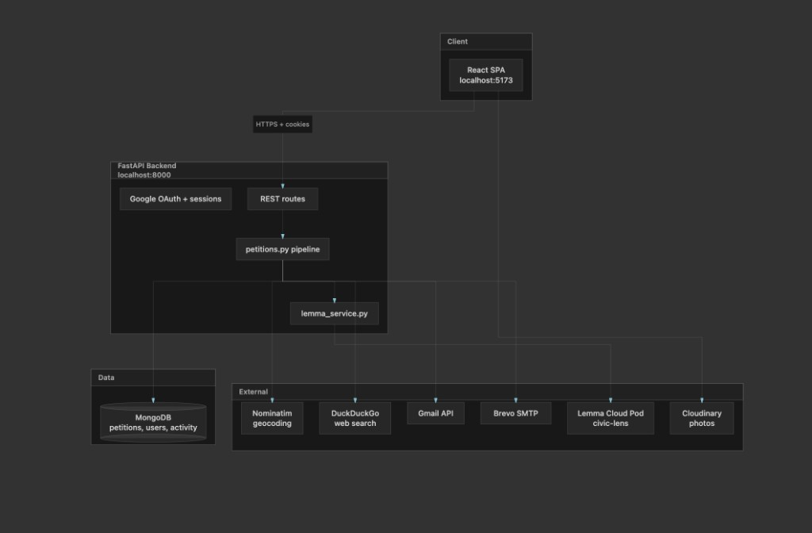
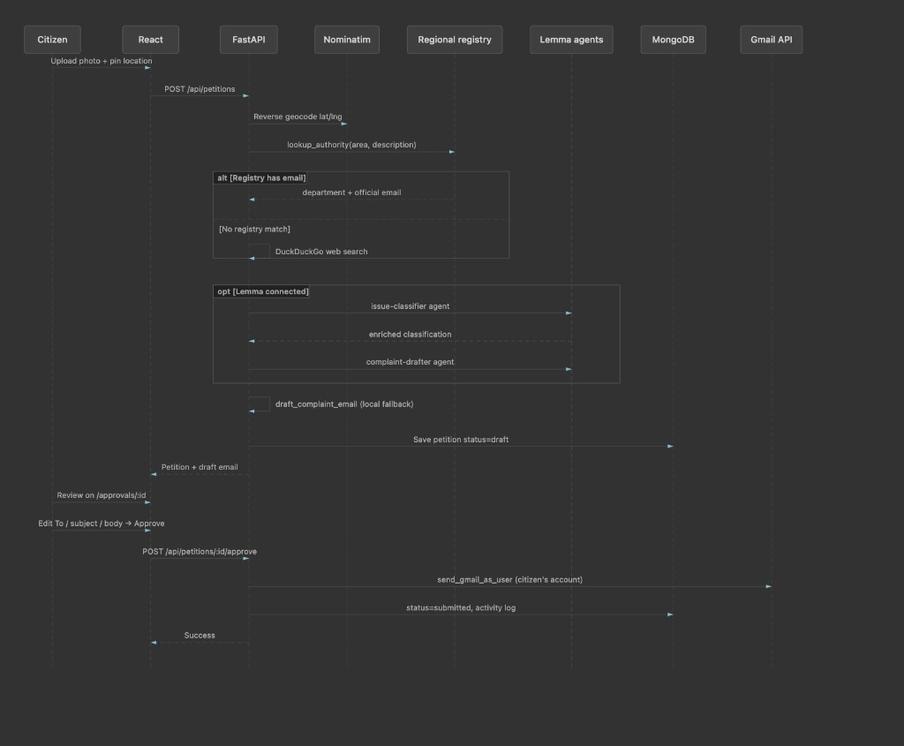

<p align="center">
  <strong>Urbis</strong><br />
  <em>See a civic problem. Route it to the right authority. Send it from your own Gmail.</em>
</p>

<p align="center">
  <a href="https://github.com/Girisankarsm/Urbis">GitHub</a> ·
  <a href="./docs/ARCHITECTURE.md">Architecture</a> ·
  <a href="./docs/API.md">API</a> ·
  <a href="./docs/DEPLOY.md">Deploy</a> ·
  <a href="https://gappy.ai">Gappy AI Hackathon</a>
</p>

---

## The problem

Citizens across Indian cities notice potholes, garbage, broken streetlights, and drainage issues every day — but most never get reported. The barrier is not apathy; it is friction. People do not know which municipality, ward, or department is responsible, especially where jurisdictions overlap. A complaint sent to the wrong office disappears. Even when someone tries, they must find the right contact, write a formal email, and follow up alone.

**Urbis** closes that gap: photo + location pin → AI classifies and routes → citizen approves the draft → email sends from **their own Gmail** → status tracked end-to-end.

---

## What Urbis does

| | |
|---|---|
| **For citizens** | Report in under a minute. Nothing is sent without your approval. |
| **For municipalities** | Structured, location-tagged complaints to the correct desk the first time. |
| **For the community** | Hub to discover and upvote issues that need urgent attention. |
| **Built on Lemma** | Agentic pipeline on a `civic-lens` pod — agents, functions, and workflows — with a verified-registry fallback if the pod is down. |

**Stack:** FastAPI · React · MongoDB · Lemma SDK · Google OAuth · Cloudinary

---

## How it works (60 seconds)

```
Report photo + pin  →  Lemma classifies & routes  →  Draft complaint email
        →  You review & approve  →  Sent from your Gmail  →  Track on Dashboard
        →  Community upvotes on Hub  →  Follow-up photo checks resolution
```

| Step | Where | What happens |
|:----:|-------|--------------|
| 1 | `/` | Welcome → Google sign-in |
| 2 | `/new` | Upload photo, pin location, describe issue |
| 3 | Backend | Geocode → **Lemma pod** (workflow + agents) → draft email |
| 4 | `/approvals/:id` | Edit recipient, subject, body → approve |
| 5 | Gmail | Complaint sent from the citizen's account |
| 6 | `/dashboard` | Track status, approve drafts, upload follow-up |
| 7 | `/hub` | Browse public reports, upvote issues that matter |

The nav polls Lemma health in the background; check `/api/health/lemma` during demos.

---

## Lemma SDK (primary path)

Urbis uses **[Lemma SDK](https://github.com/lemma-work/lemma-platform)** as the agentic infrastructure layer. When the pod is reachable, **Lemma runs first** on every report. Local verified contacts are fallback only.

### civic-lens pod (`pod/civic-lens/`)

| Type | Resources |
|------|-----------|
| **Agents** | `issue-classifier` · `complaint-drafter` · `resolution-checker` |
| **Functions** | `create_petition` · `send_complaint_email` · `escalate_petition` · `update_resolution_status` |
| **Workflows** | `petition-pipeline` · `escalation-pipeline` |
| **Tables** | `petitions` · `departments` · `activity_log` |
| **Schedule** | `daily-resolution-check` → escalation workflow |

### When each fires

| User action | Lemma resources |
|-------------|-----------------|
| Submit report | `petition-pipeline` workflow → `create_petition` → `issue-classifier` → `complaint-drafter` |
| Approve & send | `send_complaint_email` function (+ Gmail from citizen) |
| Upload follow-up | `resolution-checker` agent → `update_resolution_status` function |
| Escalate stale case | `escalation-pipeline` workflow → `escalate_petition` function |

Each petition stores `processing_path` (`lemma` \| `fallback`) and `lemma_invocations[]` for audit. Server logs use `[lemma]` prefixes during demos.

**Fallback** (if Lemma times out or pod is unreachable): verified authority registry → regional metro contacts → web search → manual edit on approval screen.

---

## Architecture

<p align="center">
  
</p>

<p align="center">
  <sub>React → FastAPI → MongoDB · Lemma pod · Gmail · Cloudinary · Nominatim</sub>
</p>

<p align="center">
  
</p>

| Layer | Technology | Role |
|-------|------------|------|
| Frontend | React 18, Vite, Tailwind | Report, approve, hub, dashboard |
| API | FastAPI, Motor | OAuth, petition pipeline, hub |
| Database | MongoDB | Petitions, users, activity, upvotes |
| AI | Lemma SDK (+ optional OpenAI Vision) | Classify, draft, verify resolution |
| Email | Gmail API (primary), Brevo SMTP (fallback) | Citizen-owned delivery |
| Images | Cloudinary | Persistent photo URLs in complaints |

---

## Features

### Core

- **Photo + map reporting** — geolocation, duplicate warnings nearby
- **Lemma-first routing** — agents find the right department; verified `.gov.in` contacts with source links
- **Human-in-the-loop** — edit To, subject, and body before anything is sent
- **Gmail send** — complaints appear in the citizen's Sent folder
- **Dashboard** — filter by status, minimal timeline, follow-up photos
- **Community Hub** — public reports, upvotes, issue filters
- **Escalation** — auto-draft after 3 days without resolution

### AI extensions

- Vision classification (optional OpenAI)
- Severity scoring with nearby infrastructure (schools, hospitals, transit)
- Resolution verification (before/after photos)
- Analytics API — trends, departments, resolution times

---

## Quick start

**Requirements:** Docker (or local MongoDB), Python 3.11+, Node 18+

```bash
./scripts/setup.sh          # once — installs deps, copies .env
./scripts/run-local.sh      # API + frontend together
```

| Service | URL |
|---------|-----|
| App | http://localhost:5173 |
| API health | http://localhost:8000/api/health |
| Lemma health | http://localhost:8000/api/health/lemma |

### Lemma setup (required for full demo)

```bash
cd backend && .venv/bin/lemma auth login
cd .. && ./scripts/sync-lemma-env.sh    # writes LEMMA_REFRESH_TOKEN to .env
# Set LEMMA_POD_ID and LEMMA_ORG_ID from lemma.work dashboard
./scripts/restart-api.sh
```

Confirm `/api/health/lemma` returns `live: true` before judging.

### Without Docker

```bash
cd backend && MONGODB_URL=mongodb://localhost:27017 .venv/bin/uvicorn app.main:app --reload --port 8000
cd frontend && npm run dev
```

---

## Environment variables

Copy `.env.example` → `.env`. Minimum for local demo:

| Variable | Purpose |
|----------|---------|
| `MONGODB_URL` | `mongodb://localhost:27017` or Atlas |
| `LEMMA_REFRESH_TOKEN`, `LEMMA_POD_ID`, `LEMMA_ORG_ID` | Lemma civic-lens pod |
| `GOOGLE_CLIENT_ID`, `GOOGLE_CLIENT_SECRET` | Sign-in + Gmail send |
| `CLOUDINARY_*` | Image hosting (required on Render) |
| `SMTP_*` | Brevo fallback if Gmail unavailable |
| `OPENAI_API_KEY` | Optional vision + resolution |
| `DEMO_EMAIL_REDIRECT` | Set `false` to email real authorities |

Production template: `.env.production.example` · Full list: `.env.example`

---

## Tests & CI

```bash
./scripts/test.sh              # backend + frontend
cd backend && pytest -q        # 53 tests
cd frontend && npm test
```

GitHub Actions runs on every push to `main`.

---

## Production deployment

See **[docs/DEPLOY.md](docs/DEPLOY.md)** for Render + Vercel + MongoDB Atlas + Cloudinary.

```bash
./scripts/check-deploy-ready.sh   # pre-flight
```

| Component | Platform |
|-----------|----------|
| API | Render (`render.yaml`) |
| Frontend | Vercel or Render static site |
| Database | MongoDB Atlas |
| Lemma pod | lemma.work (grant access for judging) |

---

## Project structure

```
backend/                 FastAPI API, services, tests
frontend/                React + Vite SPA
pod/civic-lens/          Lemma agents, functions, workflows
docs/                    Architecture, API reference, deploy guide
scripts/                 setup, run-local, sync-lemma-env, deploy checks
docker-compose.yml       Local MongoDB + API (Docker)
render.yaml              Render production blueprint
.env.example             Local environment template
.env.production.example  Production environment template
```

---

## Hackathon demo script (~90s)

1. **Sign in** with Google → check `/api/health/lemma` is live.
2. **Report** a real issue (photo + pin in Chennai/Bengaluru) → backend logs `[lemma] issue-classifier agent called`.
3. **Dashboard** → open draft → **Review & Approve** → verify authority email + source link.
4. **Send** from Gmail → timeline shows `Sent`.
5. **Hub** → upvote the public report.
6. Show `/api/health/lemma` — `processing_path: lemma` on the petition record.

**Submission links:** [GitHub](https://github.com/Girisankarsm/Urbis) · Lemma pod: `pod/civic-lens/`

---

## License

MIT — built for the [Gappy AI Hackathon](https://gappy.ai).
